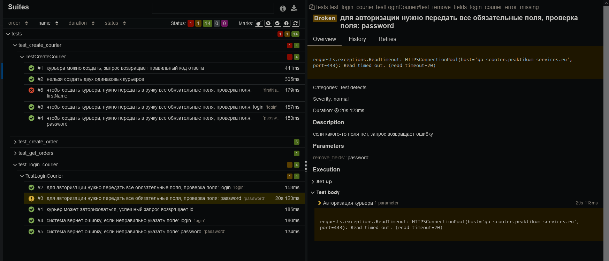

# Sprint_7
Проведены основные тесты

Тесты нне прошежшие проверку: 
1) чтобы создать курьера, нужно передать в ручку все обязательные поля, проверка поля: firstName 
выдаёт статус 201 и создаёт курьера без firstName
2)  для авторизации нужно передать все обязательные поля, проверка поля: password
вместо статуса 400 всегда уходит в ошибку с сетью